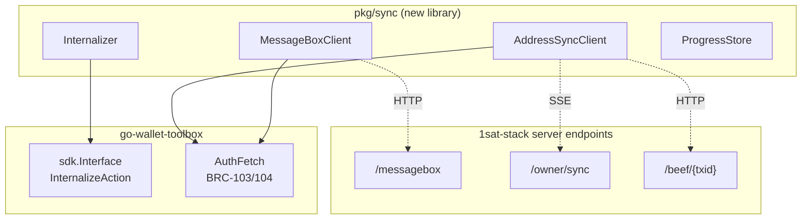
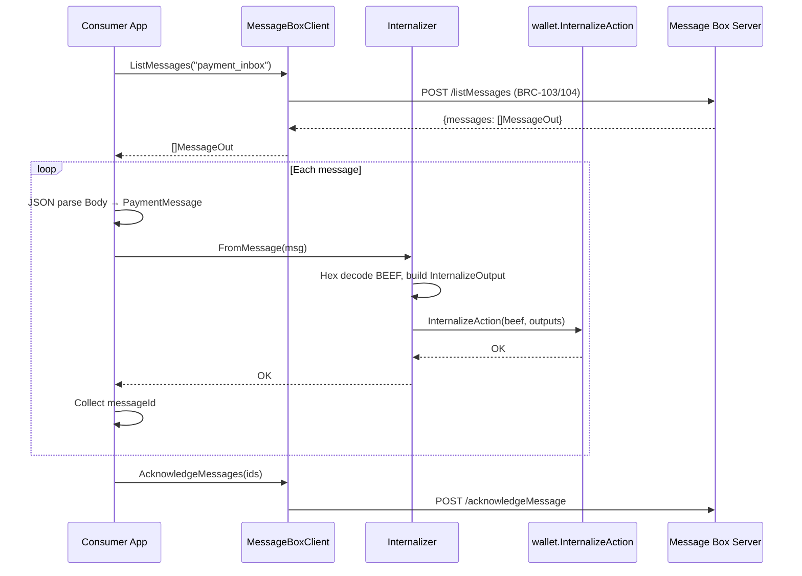
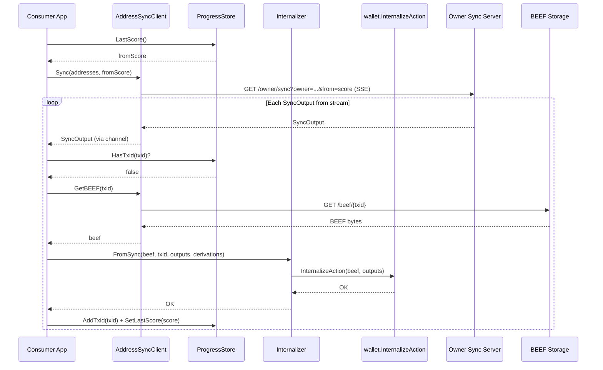

# Sync Client Packages for 1sat-stack

Reusable Go libraries for ingesting transactions into a BRC-100 wallet. Any Go project imports these to receive funds via message box or address sync.

## Package Layout

```
pkg/
├── sync/
│   ├── messagebox.go      # Message box HTTP client
│   ├── addresssync.go     # Address sync SSE client
│   ├── internalizer.go    # BEEF → wallet.InternalizeAction
│   ├── progress.go        # Txid dedup + score resumption
│   └── types.go           # Shared types
```

## Dependencies



## Types

```go
package sync

import sdk "github.com/bsv-blockchain/go-sdk/wallet"

// AddressDerivation pairs a BRC-29 address with its derivation metadata.
type AddressDerivation struct {
    Address          string
    DerivationPrefix string // base64
    DerivationSuffix string // base64
}

// PaymentMessage is the body format for wallet payment messages
// in the message box. Marshaled by 1sat-stack's paymail service
// into MessageOut.Body.
type PaymentMessage struct {
    Beef              string `json:"beef"`
    OutputIndex       uint32 `json:"outputIndex"`
    DerivationPrefix  string `json:"derivationPrefix"`
    DerivationSuffix  string `json:"derivationSuffix"`
    SenderIdentityKey string `json:"senderIdentityKey"`
    Satoshis          uint64 `json:"satoshis"`
    Alias             string `json:"alias"`
}

// MessageOut is the envelope returned by the message box API.
type MessageOut struct {
    MessageID string `json:"messageId"`
    Body      string `json:"body"`
    Sender    string `json:"sender"`
    CreatedAt string `json:"createdAt"`
    UpdatedAt string `json:"updatedAt"`
}

// SyncOutput is a single output from the address sync SSE stream.
type SyncOutput struct {
    Outpoint  string `json:"outpoint"` // "txid_vout"
    Score     int64  `json:"score"`
    SpendTxid string `json:"spendTxid,omitempty"`
}

// SyncStats reports results of a sync operation.
type SyncStats struct {
    Processed int
    Failed    int
    Skipped   int
}
```

## MessageBoxClient

```go
package sync

// MessageBoxClient talks to the message box HTTP API with BRC-103/104 auth.
type MessageBoxClient struct {
    baseURL string
    wallet  sdk.Interface
    logger  *slog.Logger
}

func NewMessageBoxClient(baseURL string, wallet sdk.Interface, logger *slog.Logger) *MessageBoxClient

// ListMessages retrieves unacknowledged messages from the given box.
func (c *MessageBoxClient) ListMessages(ctx context.Context, messageBox string) ([]MessageOut, error)

// AcknowledgeMessages marks messages as processed.
func (c *MessageBoxClient) AcknowledgeMessages(ctx context.Context, messageIDs []string) error
```

## AddressSyncClient

```go
package sync

// AddressSyncClient connects to the /owner/sync SSE endpoint.
type AddressSyncClient struct {
    ownerSyncURL string
    beefURL      string
    wallet       sdk.Interface
    logger       *slog.Logger
}

func NewAddressSyncClient(ownerSyncURL, beefURL string, wallet sdk.Interface, logger *slog.Logger) *AddressSyncClient

// Sync connects to the SSE stream and sends SyncOutputs on the returned channel.
// Blocks until stream ends or ctx is cancelled.
func (c *AddressSyncClient) Sync(ctx context.Context, addresses []string, fromScore int64) (<-chan SyncOutput, error)

// GetBEEF fetches BEEF bytes for a txid.
func (c *AddressSyncClient) GetBEEF(ctx context.Context, txid string) ([]byte, error)
```

## Internalizer

```go
package sync

// Internalizer converts BEEF + derivation info into wallet.InternalizeAction calls.
type Internalizer struct {
    wallet sdk.Interface
    logger *slog.Logger
}

func NewInternalizer(wallet sdk.Interface, logger *slog.Logger) *Internalizer

// FromMessage internalizes a PaymentMessage (from the message box).
// Uses explicit vout mode — the message tells us which output is ours.
func (i *Internalizer) FromMessage(ctx context.Context, msg *PaymentMessage) error

// FromSync internalizes outputs discovered via address sync.
// Matches outputs against address derivations to determine ownership.
func (i *Internalizer) FromSync(
    ctx context.Context,
    beef []byte,
    txid string,
    outputs []SyncOutput,
    derivations map[string]AddressDerivation,
) (bool, error)
```

## ProgressStore

```go
package sync

// ProgressStore tracks sync state for dedup and resumption.
type ProgressStore interface {
    HasTxid(ctx context.Context, txid string) (bool, error)
    AddTxid(ctx context.Context, txid string) error
    LastScore(ctx context.Context) (int64, error)
    SetLastScore(ctx context.Context, score int64) error
    Close() error
}

func NewBadgerProgressStore(path string) (ProgressStore, error)
```

## Usage

```go
wallet, _ := getFaucetWallet(ctx, faucetName)

msgClient := sync.NewMessageBoxClient(
    "https://api.1sat.app/1sat/messagebox",
    wallet,
    logger,
)

addrClient := sync.NewAddressSyncClient(
    "https://api.1sat.app/1sat/owner",
    "https://api.1sat.app/1sat/beef",
    wallet,
    logger,
)

intern := sync.NewInternalizer(wallet, logger)

progress, _ := sync.NewBadgerProgressStore("./sync-progress")
defer progress.Close()

// Message box: poll once
messages, _ := msgClient.ListMessages(ctx, "payment_inbox")
var acked []string
for _, m := range messages {
    var pm sync.PaymentMessage
    json.Unmarshal([]byte(m.Body), &pm)
    if err := intern.FromMessage(ctx, &pm); err != nil {
        logger.Error("failed to internalize", "messageId", m.MessageID, "err", err)
        continue
    }
    acked = append(acked, m.MessageID)
}
if len(acked) > 0 {
    msgClient.AcknowledgeMessages(ctx, acked)
}

// Address sync: stream once
addresses := deriveBRC29Addresses(faucetConfig)
addrStrs := make([]string, len(addresses))
for i, a := range addresses {
    addrStrs[i] = a.Address
}
fromScore, _ := progress.LastScore(ctx)
ch, _ := addrClient.Sync(ctx, addrStrs, fromScore)
derivationMap := buildDerivationMap(addresses)
for output := range ch {
    txid := extractTxid(output.Outpoint)
    if has, _ := progress.HasTxid(ctx, txid); has {
        continue
    }
    beef, _ := addrClient.GetBEEF(ctx, txid)
    intern.FromSync(ctx, beef, txid, []sync.SyncOutput{output}, derivationMap)
    progress.AddTxid(ctx, txid)
    progress.SetLastScore(ctx, output.Score)
}
```

## Flow: Message Box Sync



## Flow: Address Sync


